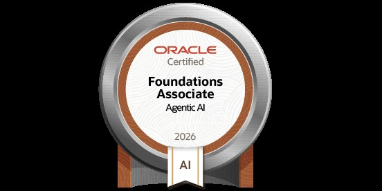

  

  <h1>Muhammad Hamza</h1>

  
<strong>Data Scientist · Full-Stack Developer · AI Engineer.</strong>

  

    
    
    
  

  

    <a href="https://github.com/MuhammadHamza123c">GitHub</a> ·
    <a href="https://www.linkedin.com/in/muhammad-hamzads">LinkedIn</a> ·
    <a href="mailto:muhammadhamzao241@gmail.com">Email</a> ·
  
  

---

## About Me

I'm a Data Science student at Emerson University, Multan with a perfect **4.00 GPA**. I build end-to-end AI-powered applications — from training ML models to deploying full-stack products. I'm passionate about turning complex problems into elegant, scalable solutions.

**What I do:**
- 🧠 Build AI applications with LangChain, Groq, and OpenAI
- 📊 Data Science, Machine Learning, and Deep Learning (CNNs)
- 🌐 Full-stack web development with FastAPI, Next.js, and Supabase
- 📡 Arduino IoT projects for real-world problems
- 🔍 Web scraping and automation

---

## Projects

### 🤖 Machine Learning & AI

| Project | Description | Tech |
|---|---|---|
| **Diabetes Prediction** | ML model predicts diabetes with 97% accuracy | Python, Scikit-learn |
| **Titanic Survival** | Predict survival using classification models | Python, Pandas |
| **Banana Quality Classification** | Image classification using CNNs | Python, TensorFlow |
| **Movie Recommendation System** | Content-based movie suggestions | Python, Pandas |
| **Heart Problem Prediction** | Cardiac risk prediction with classification | Python, Scikit-learn |
| **Weather Prediction** | Temperature & humidity regression | Python, Matplotlib |
| **Personality Detection** | Introvert vs extrovert classification | Python, NLP |
| **Score Prediction** | Academic score estimation from features | Python, Regression |
| **CropSense** | Smart crop prediction — 99.19% accuracy, 22 crops, IoT-ready with NPK/pH/temp sensors | Python, Scikit-learn, Streamlit |

### 🧠 NLP & Text Analysis

| Project | Description | Tech |
|---|---|---|
| **Emotion & Sentiment Analysis** | Detect emotions and sentiment from text | Python, NLP |
| **Email Spam Classifier** | Classify emails as spam or legitimate | Python, Scikit-learn |

### 🌐 Gen AI / LangChain

| Project | Description | Tech |
|---|---|---|
| **QuizzVerse** | AI-powered quiz platform with multiplayer rooms | Next.js, FastAPI, Groq, Supabase |
| **Flight Agent AI** | Multi-agent travel assistant — trip planning, flight/hotel booking, local language teaching, destination images, emergency alerts | LangChain, LangGraph, Gemini, Pixabay API, SMTP |
| **Mental Health Helper AI** | Conversational AI for mental health support | LangChain, Groq |
| **PDF Question Answering App** | Ask questions from any PDF using RAG | LangChain, OpenAI |
| **Business Management Chatbot** | Automate sales, emails, and workflows | LangChain, Python |
| **InFact** | Real-time fake news detector — 3 search agents (Google, Serper, GNews), LLM verification, 90%+ accuracy | LangChain, Groq, Streamlit |
| **Library Assistant** | AI library chatbot — semantic book search via ChromaDB, OCR from book covers, WhatsApp bot integration, library rules Q&A | LangChain, Groq, ChromaDB, FastAPI, Tesseract, n8n |
| **auto-scraper-rag** | Automated web scraping + RAG pipeline — scrapes sites, stores in vector DB, intelligent Q&A over content | BeautifulSoup, LangChain |

### 📡 IoT & Arduino

| Project | Description | Tech |
|---|---|---|
| **Water Monitoring** | Real-time water quality tracking | Arduino, Sensors |
| **Home Automation** | Smart home control system | ESP8266, Arduino |
| **Women Safety Device** | Emergency alert system for safety | Arduino, GSM |
| **Weather Station** | Automated weather data collection | ESP32, Sensors |
| **Anti-Sleep Glasses** | Detect drowsiness and alert driver | Arduino, Sensors |
| **Plant Watering System** | Automated plant irrigation | Arduino, Soil Sensors |
| **Special Glasses for Blind People** | Obstacle detection for visually impaired | Arduino, Ultrasonic |

### 🗣️ AI & Automation

| Project | Description | Tech |
|---|---|---|
| **Jarvis** | Voice-activated personal assistant | Python, Speech Recognition |
| **Haq Ki Baat** | AI legal assistant — chat-based legal Q&A with image/PDF document upload | Python, Streamlit, FastAPI |
| **TextGuard** | AI vs Human text classification | Python, NLP |
| **summary-keyword-agent** | AI agent for text summarization | LangChain, Gemini |
| **TuneBuddy** | Song recommendation system | Python, Spotify API |
| **TalentPilot** | AI career platform — resume builder (4 templates), ATS analysis, interview coach, job recommendations, career path advisor, tech dashboards, roadmap generator | HTML, FastAPI, Groq, Supabase |
| **MovieSphere** | Full-stack movie/TV streaming platform with AI recommendations, real-time watch parties, reels, push notifications, trivia quiz, and credit system | React 19, Vite, FastAPI, Supabase, Groq, LiveKit, TMDB, YouTube API |

---

## Skills

<table>
  <tr>
    <td><strong>Languages</strong></td>
    <td>Python, C, C++, Java, SQL, NoSQL, TypeScript, JavaScript</td>
  </tr>
  <tr>
    <td><strong>AI / ML</strong></td>
    <td>TensorFlow, Keras, Scikit-learn, LangChain, LangGraph, OpenCV, NLP, RAG Pipelines</td>
  </tr>
  <tr>
    <td><strong>Data Science</strong></td>
    <td>Pandas, NumPy, Matplotlib, Seaborn, Plotly, Scikit-learn</td>
  </tr>
  <tr>
    <td><strong>Web Development</strong></td>
    <td>FastAPI, Flask, Next.js, React, Tailwind CSS, Supabase</td>
  </tr>
  <tr>
    <td><strong>LLM / Gen AI</strong></td>
    <td>Groq, OpenAI, LangChain, RAG, Whisper, LangGraph</td>
  </tr>
  <tr>
    <td><strong>DevOps & Tools</strong></td>
    <td>Git, GitHub, Vercel, Jupyter Notebook, Google Colab, VS Code</td>
  </tr>
  <tr>
    <td><strong>IoT</strong></td>
    <td>Arduino, ESP8266, ESP32, Microcontrollers, Sensors</td>
  </tr>
</table>

---

## Certificates

### Oracle Agentic AI Certified Foundations Associate

  

**Issued by Oracle** — 19 July 2026

A practical, build-it-yourself introduction to AI agents. You'll leave understanding what an agent really is having built one from scratch, used LangChain, the OpenAI Agents SDK, a real MCP server, and seen where agents run in production using OCI Enterprise AI Agents service and Agentic AI features in the Oracle AI Database.

**Skills:** Understand core AI agent concepts · Build agents using LangChain · Apply Model Context Protocol concepts · Use OpenAI agent development capabilities · Use OCI Enterprise AI Agents · Apply Oracle AI Database capabilities for agentic AI

---

## Contact

  
  
  

---

  
Designed &amp; developed by <strong>Muhammad Hamza</strong>

  
<em>Data Scientist · Full-Stack Developer · AI Engineer</em>

